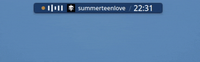

<div align="center">


# Dynamic Island for KDE Plasma 6

A Dynamic Island-inspired status capsule for KDE Plasma.

Music. Notifications. Downloads. Screen sharing. IDE builds. System status.
All in a single adaptive panel widget.

[](LICENSE)


</div>

---

## Preview

<p align="center">
  
</p>

---

## What is it?

Dynamic Island transforms a small area of your Plasma panel into an intelligent status capsule.

When nothing is happening, it displays a clean clock.

When an event occurs, it smoothly morphs into a compact interactive widget for media playback, notifications, downloads, keyboard layout changes, screen sharing, IDE build results, and system information.

Click the capsule to expand a glass-style panel with detailed information and controls.

---

## Features

### Music (MPRIS)

* Album artwork
* Animated audio bars
* Playback progress
* Previous / Play / Pause / Next controls
* Compact and expanded modes

### Notifications

* App icon and title
* Multi-line notification preview
* Animated unread indicator
* Configurable body length

### Keyboard Layout

* Full layout names
* Visual layout switch announcements

### Downloads & Jobs

* Active task detection
* Real-time progress tracking

### Screen Sharing

* Capture and presentation indicators
* Special sharing state while media is playing

### IntelliJ IDEA Integration

* IntelliJ IDEA
* Android Studio
* Gradle
* Maven

Displays build results directly in the capsule with dedicated success and failure states.

### System Monitoring

* CPU usage
* RAM usage
* Automatic rotation with the idle clock

### FPS Counter

* Optional real-time FPS display
* Multiple visual styles

### Customization

* Capsule sizes
* Expanded panel sizes
* Colors and opacity
* Corner radius
* Accent colors
* Animation speed
* Module order
* Per-feature toggles

---

## How It Works

Only the most important information is displayed at any given time.

Priority order:

Build Results → Sharing + Music → Notifications → Keyboard Layout / Downloads → Music → Sharing → Clock

The compact capsule is composed of three independent blocks:

* Content
* Time
* FPS

These blocks can be reordered and separated with optional dividers.

---

## Configuration

Dynamic Island includes a complete settings panel.

Available categories:

* Size & Shape
* Layout
* Appearance
* Clock
* Notifications
* Modules
* System & FPS
* Animations

Almost every visual aspect can be customized without editing any files.

---

## Requirements

* KDE Plasma 6.0+
* Qt 6

Optional:

* plasma-systemmonitor
* libksysguard

(Installed by default on most Plasma distributions.)

---

## Installation

Download the latest release and install the `.plasmoid` package.

Or build manually:

```bash
./install.sh
```

Then restart Plasma or reload the widget.

---

## Development

The project is written entirely in QML.

```text
package/
├── metadata.json
└── contents/
    ├── config/
    └── ui/
```

No build step required.

Edit, install, reload, repeat.

---

## License

MIT License

© 2026 ifny75
